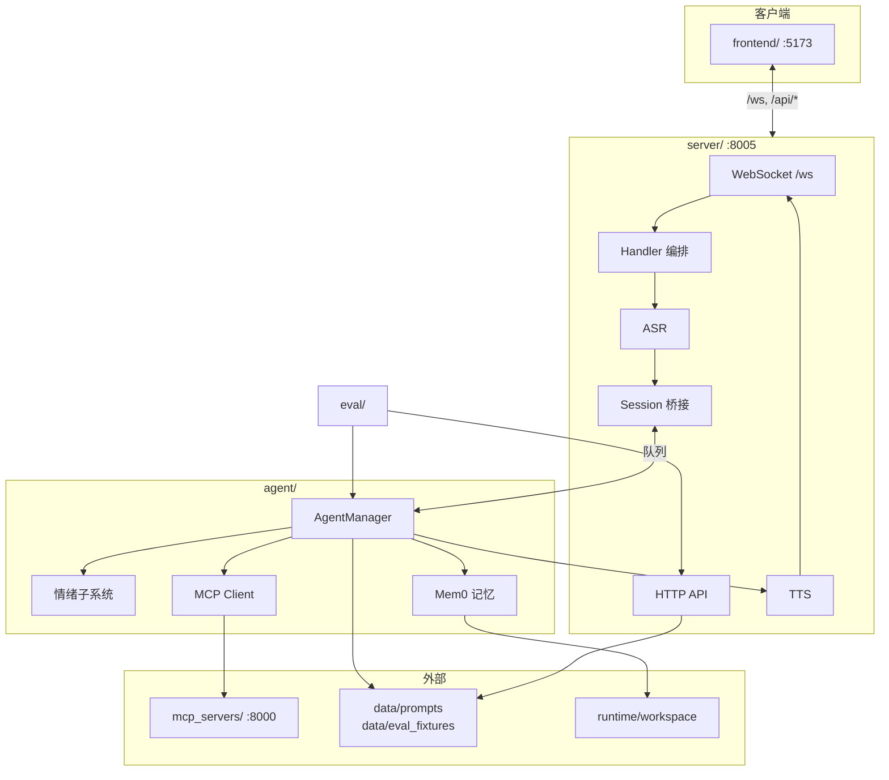

# GardenAI

面向庭院 / 智能家居场景的个人 AI 管家。整合语音与文本会话、可长期运行的智能体内核，以及对庭院设备（割草机、灌溉、泳池、机械臂等）的 MCP 控制。

## 项目能力

| 能力 | 说明 |
|------|------|
| **多模态对话** | WebSocket 实时会话，支持语音输入（ASR）、语音输出（TTS）与纯文本模式 |
| **智能体推理** | LangGraph deep agent，支持工具调用、子 Agent、对话摘要 |
| **情绪建模** | 每轮 LLM 评估用户情绪，维护 VAD 状态，驱动 TTS 语气与前端情感展示 |
| **长期记忆** | Mem0 + FAISS 向量检索，支持会话 flush、摘要触发写入、「记住」即时写入 |
| **设备控制** | 通过 MCP 连接庭院设备模拟服务，智能体可调用割草、灌溉等工具 |
| **提示词热编辑** | `soul.yaml` 等提示词每轮从磁盘加载，Web UI `/config` 可视化编辑 |
| **自动化评测** | 场景回归、L0 断言、LLM Judge、情绪支持专项，前端 Test Panel 触发 |

## 模块架构

各模块职责与内部架构见对应 README：

| 模块 | 职责 | 文档 |
|------|------|------|
| **`server/`** | WebSocket 传输、Handler 编排、ASR/TTS/Session 多模态服务 | [server/README.md](server/README.md) |
| **`agent/`** | LangGraph 智能体内核、情绪、记忆、MCP 工具、中间件链 | [agent/README.md](agent/README.md) |
| **`eval/`** | 场景评测、Judge、异步任务、结果持久化 | [eval/README.md](eval/README.md) |
| **`prompt_editor/`** | 提示词 YAML HTTP 编辑、记忆导出 API | [prompt_editor/README.md](prompt_editor/README.md) |
| **`shared/`** | 配置加载（`.config.yaml` + `.env`）、结构化日志 | [shared/README.md](shared/README.md) |
| **`data/`** | 提示词、评测 fixture、Agent 配置（可版本管理） | [data/README.md](data/README.md) |
| **`mcp_servers/`** | 庭院设备 MCP Server（独立进程） | [mcp_servers/README.md](mcp_servers/README.md) |
| **`frontend/`** | 移动优先 Web UI（聊天、`/config`、Test Panel） | [frontend/README.md](frontend/README.md) |
| **`runtime/`** | 运行时产物（workspace、eval_runs、logs，已 gitignore） | — |

### 能力如何实现



**一条语音对话的链路**：

1. `frontend` 经 WebSocket 发送 Opus 音频 → `server/transport`
2. `handler/default.py` 解码 → `multimodal/audio` ASR → 文本
3. `multimodal/session` 将文本包装为 `InputEvent` 入队 → `agent/AgentManager`
4. Agent 经中间件注入人设、情绪、记忆后推理，流式输出 `OutputEvent`
5. Handler 将文本回传客户端，并（语音模式）送入 `multimodal/tts` 合成 → Opus 回传

**设备控制**：Agent 启动时从 `data/agent_configs/mcp_servers.yaml` 加载 MCP 工具；需独立启动 `mcp_servers/garden_system/mcp_server.py`。

**评测**：`eval/` 直接调用 `AgentManager.achat()`，不经 WebSocket；API 挂载在 `server/app.py`，进度经 WebSocket 推送到 Test Panel。

## 快速启动

### 1. 安装

推荐 [uv](https://github.com/astral-sh/uv)：

```bash
uv venv
uv pip install -e .
```

### 2. 配置

**`.env`（密钥）** — 复制 `env.example` 为 `.env`，至少配置：

```dotenv
DASHSCOPE_API_KEY=...
```

**`.config.yaml`（运行时参数）** — 参考 `config.example.yaml`，至少配置：

```yaml
llm_model_name: "glm-4-flash"
llm_base_url: "https://open.bigmodel.cn/api/paas/v4/"
```

配置加载细节见 [shared/README.md](shared/README.md)。

### 3. 启动服务

```bash
# 庭院设备 MCP（需要设备控制能力时启动）
python mcp_servers/garden_system/mcp_server.py

# 统一服务端（WebSocket + HTTP API，默认 :8005）
python -m server

# 聊天前端
cd frontend && npm install && npm run dev
```

推荐联调顺序：先 `python -m server`，再 `cd frontend && npm run dev`。

仅验证智能体本体：

```bash
python examples/demo.py
```

### 4. 访问

| 服务 | 地址 |
|------|------|
| 前端 | `http://localhost:5173` |
| 后端 API / WebSocket | `http://localhost:8005` |
| MCP Server | `http://localhost:8000/mcp` |

前端开发服务器已将 `/ws` 与 `/api/*` 代理到 `:8005`。

## 配置要点

### 纯文本模式（跳过 ASR/TTS）

在 `.config.yaml` 中设置：

```yaml
input_modality: ["text"]
output_modality: ["text"]
```

无需配置语音相关 API Key。

### Mem0 长期记忆（可选）

```yaml
memory_enabled: true
mem0_embedding_model: "embedding-3"
mem0_embedding_dims: 1536
```

向量索引落在 `runtime/workspace/memory/faiss/`。首次启用需：

```bash
python -m spacy download en_core_web_sm
```

Session 写入策略（默认）：

| 时机 | 行为 |
|------|------|
| LangGraph 对话摘要 | 立即 flush 当前会话 |
| 上一轮结束且空闲满 5 分钟 | flush（`memory_session_flush_idle_sec`） |
| 进程退出 | 兜底 flush |
| 用户说「记住」/ `remember` 工具 | 即时写入 |

### 提示词与心情

- 灵魂文件：`data/prompts/soul.yaml`（详见 [data/README.md](data/README.md)）
- 心情模板：`data/prompts/agent_mood.yaml`
- 情感策略：`data/prompts/affective.yaml`
- Web 编辑：启动 server 后访问 `/config`

### MCP 设备工具

确认 `mcp_servers` 已在 `:8000` 运行，并在 `data/agent_configs/mcp_servers.yaml` 中启用对应配置（默认注释）。不可达时日志会有 `[warn] MCP server '...' is unavailable`，不会导致崩溃。

## 常见坑

- **启动报 LLM 相关错误**：检查 `.env` 的 `DASHSCOPE_API_KEY` 与 `.config.yaml` 的 `llm_base_url`。
- **WebSocket 连接后立刻断开**：检查 ASR/TTS 工厂模块路径、Opus 库是否安装（conda 环境 `igard` 已包含）。
- **智能体调不到设备工具**：确认 MCP Server 已启动且 `mcp_servers.yaml` 已放开配置。
- **局域网语音**：手机 / 局域网 IP 访问需 HTTPS，证书见 `web-portal/ssl/README.txt`。

## 测试

仓库内已移除 pytest 套件。Agent 质量回归通过 **`eval/` + `data/eval_fixtures/`** 在服务运行后由前端 Test Panel 或 `/api/eval/*` 执行。

```bash
python -m server
# 然后使用 Test Panel / eval API 跑 smoke、judge 场景
```
