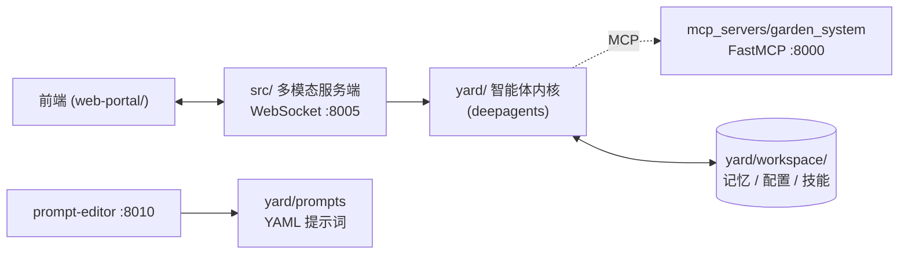

# GardenAI

一个面向庭院 / 智能家居场景的个人 AI 管家。它把语音和文本会话、可长期运行的智能体内核，以及对庭院设备（割草机、灌溉、泳池、机械臂等）的控制整合在一起。

## 架构

项目由三块组成：

- **`src/`** — 基于 WebSocket 的多模态服务端，处理前端连接、ASR、TTS，并把消息转发给智能体。
- **`frontend/`** — 独立移动优先聊天 UI（仅对话，不提供参数编辑/日志/控制入口）。
- **`yard/`** — 智能体内核，基于 [`deepagents`](https://github.com/langchain-ai/deepagents) / LangGraph，负责对话、技能、记忆、心跳和定时任务。
- **`mcp_servers/garden_system/`** — 用 [FastMCP](https://github.com/jlowin/fastmcp) 把设备控制能力暴露成工具，供智能体调用。



旁路的 `src/prompt-editor-server.py` 是一个本地 HTTP 服务，用来在浏览器里查看和编辑 `yard/prompts/` 下的 YAML 提示词配置，跑不跑都不影响主流程。经 nginx 同源暴露时，建议使用路径前缀 **`/api/prompt-editor/`**（详见 `web-portal/nginx-lan-proxy.server.conf.example`）；直连 `:8010` 时仍可使用兼容路径 **`/api/prompts-yaml/`**。

## 配置

### 1. 安装

推荐用 [uv](https://github.com/astral-sh/uv)：

```bash
uv venv
uv pip install -e .
```

### 2. `.env`

复制 `env.example` 为 `.env`，至少填好 LLM 的两项：

```dotenv
GLM_OPENAI_API_KEY=...
GLM_OPENAI_BASE_URL=...
```

按需再填 ASR / TTS 的 key（只用文本对话时可以不填）。

### 3. `.config.yaml`（可选）

需要改 host、port、模型名、工作区路径之类的运行时参数时，参考 `config.example.yaml` 在项目根目录建一个 `.config.yaml`。不建文件就跑默认值。

### 4. Mem0 OSS 长期记忆（可选）

在 `.config.yaml` 中启用（需已配置 GLM OpenAI 兼容端点，并指定 embedding 模型）：

```yaml
memory_enabled: true
mem0_embedding_model: "embedding-3"   # 智谱等兼容 embedding 模型名
mem0_embedding_dims: 1536
```

也可在 `.env` 中设置 `MEM0_EMBEDDING_MODEL`。向量索引落在 `yard/workspace/memory/faiss/`。在 web-portal 的 YAML 面板点击「查看记忆」可导出只读 `yard/prompts/memory/memory.yaml`（已 gitignore，不参与对话注入）。

**Session 对话写入 Mem0**（动态策略，与 30 分钟 heartbeat 解耦，默认）：

| 时机 | 默认 |
|------|------|
| LangGraph 对话摘要（上下文过长自动压缩） | 立即 flush 当前会话 |
| 上一轮对话结束且空闲满 5 分钟 | flush（`memory_session_flush_idle_sec`） |
| 进程退出 | 兜底 flush |
| 用户说「记住」/ `remember` 工具 | 即时写入 |

30 分钟 heartbeat 仅用于可选的 `memory/YYYY-MM-DD.md` 日记同步（`memory_journal_on_heartbeat`）。可在 `.config.yaml` 调整 `memory_session_flush_idle_sec`（设为 `0` 关闭空闲写入）、`memory_session_flush_on_summarization`。

### 5. 灵魂提示词与心情（`yard/prompts`）

- **灵魂文件**：`yard/prompts/soul.yaml` 合并原 base + 角色正文；`PersonaPromptMiddleware` 按通用模板渲染为 system prompt，每轮从磁盘热加载。
- **few-shot**：`speech_examples` 等块写在 `soul.yaml` 中，由渲染器格式化为 User/Assistant 示例。
- **心情**：情绪 middleware 使用 `yard/prompts/moods/levels.yaml` 五档说明；VAD baseline / TTS 音色 v1 为代码默认值，后续可在 frontend `/config` 编辑（TODO）。
- **编辑**：`python src/prompt-editor-server.py` + 聊天页笔形图标进入 `/config`（桌面三栏，仅 `soul.yaml` 可表单编辑）。
- 从旧结构迁移：`python scripts/merge_soul_yaml.py`（需保留 `base/` 与 `roles/Lora.yaml` 备份时方可重跑）。

## 运行

按需启动以下进程，互相独立：

```bash
# 庭院设备 MCP Server（要让智能体能控制设备就启动它）
python mcp_servers/garden_system/mcp_server.py

# 多模态服务端，前端用浏览器打开 web-portal/index.html 连这个
python src/server.py

# 新聊天前端（仅对话 UI）
cd frontend && npm install && npm run dev

# 提示词编辑后台（可选，用来在浏览器里编辑 yard/prompts/ 下的 yaml 文件）
python src/prompt-editor-server.py
```

## Frontend Chat

- `frontend` 承载聊天与 `soul.yaml` 提示词配置（`/config`）；其它参数与日志仍可由 `web-portal` 修改。
- 推荐联调顺序：
  1. 启动服务端：`python src/server.py`
  2. 启动前端：`cd frontend && npm install && npm run dev`

如果只想跑智能体本体试一下：

```bash
python examples/demo.py
```

## 常见坑

- **启动报 `LLM API key and base url are required`**：`.env` 里的 `GLM_OPENAI_API_KEY` / `GLM_OPENAI_BASE_URL` 没填好。
- **智能体调不到设备工具**：确认 MCP Server 已在 `:8000` 启动，并在 `yard/configs/mcp_servers.yaml` 里放开对应配置（默认是注释掉的）。MCP Server 不可达不会让程序崩溃，但日志里会有 `[warn] MCP server '...' is unavailable`。
- **不想用语音**：在 `.config.yaml` 里把 `input_modality` / `output_modality` 都设成 `["text"]`，可以跳过 ASR / TTS 的所有 key 配置。
