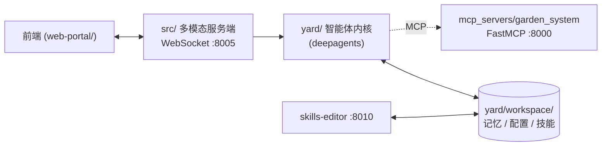

# GardenAI

一个面向庭院 / 智能家居场景的个人 AI 管家。它把语音和文本会话、可长期运行的智能体内核，以及对庭院设备（割草机、灌溉、泳池、机械臂等）的控制整合在一起。

## 架构

项目由三块组成：

- **`src/`** — 基于 WebSocket 的多模态服务端，处理前端连接、ASR、TTS，并把消息转发给智能体。
- **`yard/`** — 智能体内核，基于 [`deepagents`](https://github.com/langchain-ai/deepagents) / LangGraph，负责对话、技能、记忆、心跳和定时任务。
- **`mcp_servers/garden_system/`** — 用 [FastMCP](https://github.com/jlowin/fastmcp) 把设备控制能力暴露成工具，供智能体调用。



旁路的 `src/skills-editor.py` 是一个本地 HTTP 服务，用来在浏览器里查看和编辑 `yard/workspace/` 下的 Markdown 文件（智能体的"记忆"和配置），跑不跑都不影响主流程。

## 配置

### 1. 安装

推荐用 [uv](https://github.com/astral-sh/uv)：

```bash
uv venv
uv pip install -e .
```

### 2. `.env`

复制 `env.example` 为 `.env`，至少填好 LLM 的两项：

```dotenv
GLM_OPENAI_API_KEY=...
GLM_OPENAI_BASE_URL=...
```

按需再填 ASR / TTS / Mem0 的 key（只用文本对话时可以不填）。

### 3. `.config.yaml`（可选）

需要改 host、port、模型名、工作区路径之类的运行时参数时，参考 `config.example.yaml` 在项目根目录建一个 `.config.yaml`。不建文件就跑默认值。

## 运行

按需启动以下进程，互相独立：

```bash
# 庭院设备 MCP Server（要让智能体能控制设备就启动它）
python mcp_servers/garden_system/mcp_server.py

# 多模态服务端，前端用浏览器打开 web-portal/index.html 连这个
python src/server.py

# Yaml 工作区后台（可选，用来在浏览器里编辑 yard/prompts/ 下的 yaml文件）
python src/skills-editor.py
```

如果只想跑智能体本体试一下：

```bash
python examples/demo.py
```

## 常见坑

- **启动报 `LLM API key and base url are required`**：`.env` 里的 `GLM_OPENAI_API_KEY` / `GLM_OPENAI_BASE_URL` 没填好。
- **智能体调不到设备工具**：确认 MCP Server 已在 `:8000` 启动，并在 `yard/configs/mcp_servers.yaml` 里放开对应配置（默认是注释掉的）。MCP Server 不可达不会让程序崩溃，但日志里会有 `[warn] MCP server '...' is unavailable`。
- **不想用语音**：在 `.config.yaml` 里把 `input_modality` / `output_modality` 都设成 `["text"]`，可以跳过 ASR / TTS 的所有 key 配置。
