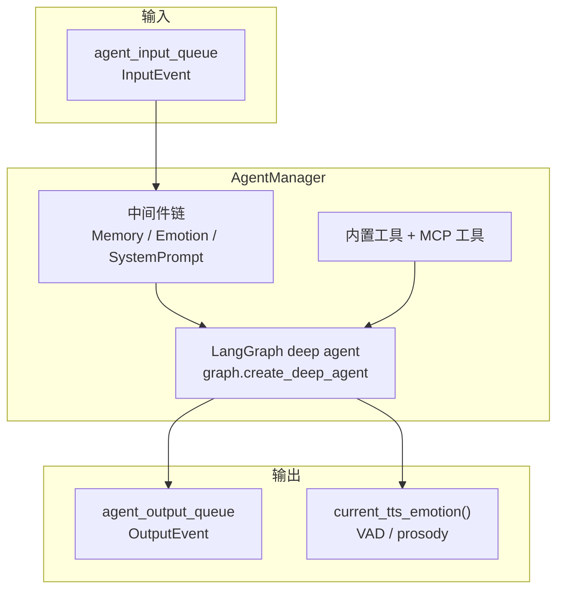

# agent — 智能体内核

`agent/` 是 GardenAI 的推理与决策核心，不直接处理 HTTP/WebSocket。它负责 LLM 对话、工具调用、情绪建模、长期记忆，以及通过 MCP 控制外部设备。

## 职责

| 能力 | 实现位置 |
|------|----------|
| LangGraph 对话与工具循环 | `manager.py`、`graph.py` |
| 人设 / 系统 Prompt 注入 | `middlewares/system_prompt.py`、`prompt/compose`、`prompt/persona`、`prompt/turn_plan` |
| 情绪评估与 VAD 状态 | `emotion/` |
| Mem0 长期记忆与会话 flush | `memory/` |
| MCP 工具加载 | `manager.load_mcp_tools()` |
| 定时心跳与本地 cron | `heartbeat.py`、`timer.py` |
| 结构化日志 / Langfuse | `observability/` |

## 架构



### 中间件装配顺序

1. `MemoryRecallMiddleware` — 检索长期记忆（及显式 remember）
2. `MemoryFlushOnSummarizeMiddleware` — 对话摘要后 flush 会话到 Mem0
3. `ToolLoopGuardMiddleware` — 拦截重复工具调用
4. `EmotionAppraisalMiddleware` — LLM 评估用户情绪
5. `SystemPromptMiddleware` — 唯一 system prompt 拼装入口（soul / A2UI / mood / affective / memory）

### 关键入口

- **`AgentManager.create()`** — 唯一完整装配入口：加载 MCP 工具、初始化情绪/记忆子系统、创建 LangGraph agent、启动 input worker
- **`AgentManager.achat()` / `astream()`** — 流式对话（eval 与 demo 直接使用）
- **`agent/events.py`** — `InputEvent` / `OutputEvent` 队列协议，供 `server/multimodal/session/` 桥接

## 与外部模块的关系

```
server/multimodal/session/  ──队列──►  agent/manager.py
eval/application/           ──achat──►  agent/manager.py
examples/demo.py            ──achat──►  agent/manager.py

agent/manager.py  ──MCP Client──►  mcp_servers/ (:8000)
agent/manager.py  ──读配置──►     data/agent_configs/mcp_servers.yaml
agent/middlewares/ ──热加载──►    data/prompts/
agent/memory/      ──持久化──►    runtime/workspace/memory/
```

## 配置

Agent 运行时配置由 `shared/config` 统一加载（`agent/configs/` 仅为兼容重导出）：

- `.config.yaml` → `load_agent_settings()` → `AgentConfig`
- `.env` → `load_secrets()` → API Key 等密钥
- `resolve_agent_runtime()` 合并二者，注入 `llm_base_url`、FAISS 路径等

详见 [shared/README.md](../shared/README.md)。

## 独立运行

不启动 server 也可验证智能体：

```bash
python examples/demo.py
```
