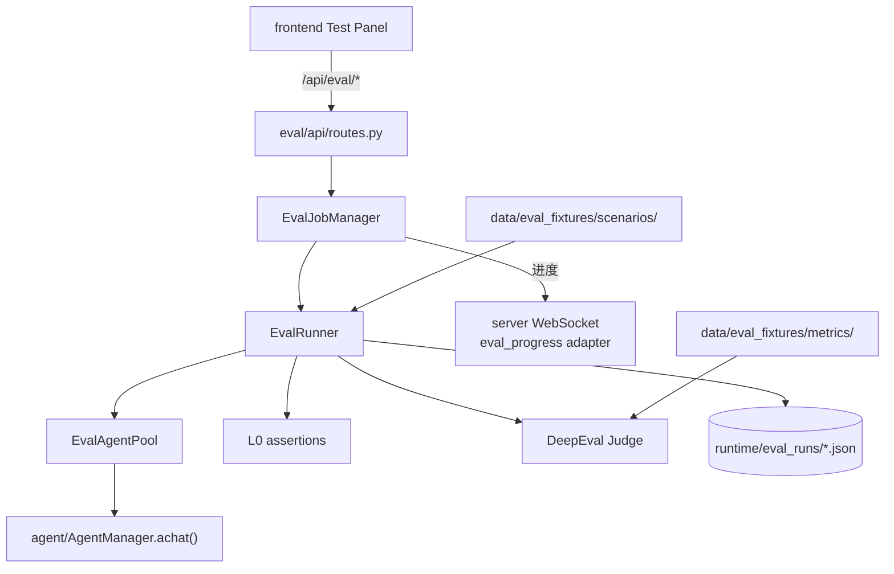

# eval — 评测子系统

`eval/` 对 Agent 进行自动化回归与质量评测：多轮场景对话、L0 规则断言、LLM Judge（DeepEval GEval）、情绪支持专项评测。支持同步执行与后台异步任务，结果持久化到 `runtime/eval_runs/`。

## 职责

| 能力 | 实现位置 |
|------|----------|
| HTTP API | `api/routes.py` |
| 异步任务与取消 | `application/job_manager.py` |
| Agent 调用封装 | `application/agent_client.py` |
| 进程级 Agent 复用 | `application/agent_pool.py` |
| 场景编排主流程 | `domain/runner.py` |
| YAML 场景加载 | `domain/scenario.py` |
| L0 断言 | `domain/assertions/` |
| LLM Judge | `domain/judge/` |
| 模拟用户 | `domain/users/` |
| 结果持久化 | `infrastructure/persistence.py` |

## 架构



### 分层设计

```
eval/
├── api/            # HTTP 路由（挂载到 server/app.py）
├── application/    # 用例编排：任务管理、Agent 客户端、连接池
├── domain/         # 纯业务：场景、断言、Judge、模拟用户
└── infrastructure/ # I/O：持久化、环境探测、遥测记录
```

### 主要 API

| 路径 | 说明 |
|------|------|
| `GET /api/eval/scenarios` | 列出可用场景 |
| `POST /api/eval/scenario/run` | 同步运行单个场景 |
| `POST /api/eval/runs` | 提交异步评测任务 |
| `GET /api/eval/runs/{id}` | 查询任务状态与结果 |
| `POST /api/eval/emotion-support/run` | 情绪支持专项评测 |

进度事件通过 `server/adapters/eval_progress.py` 经 WebSocket 推送到前端 Test Panel。

## 场景与指标数据

- **场景**：`data/eval_fixtures/scenarios/smoke/`（冒烟）、`judge/`（需 Judge）
- **指标定义**：`data/eval_fixtures/metrics/`（如 `emotion_support.yaml`、`safety.yaml`）
- **运行结果**：`runtime/eval_runs/eval_*.json`（gitignore）

## 运行测试

```bash
# 冒烟场景（PR 级）
pytest -m smoke tests/eval/

# Judge 场景（Nightly）
pytest -m judge tests/eval/

# 全量单元测试
pytest tests/eval/unit/
```

评测 API 随 `python -m server` 一同启动，无需单独进程。

## 与外部模块的关系

- **挂载点**：`server/app.py` 调用 `create_eval_routes(job_manager)`
- **Agent**：`EvalAgentClient` 直接 `await AgentManager.create()` 并 `achat()`，不经 WebSocket 队列
- **配置**：`shared.config.resolve_eval_scenarios_dir()` 解析场景目录
- **前端**：`frontend/src/features/test/`、`frontend/src/services/eval/`
