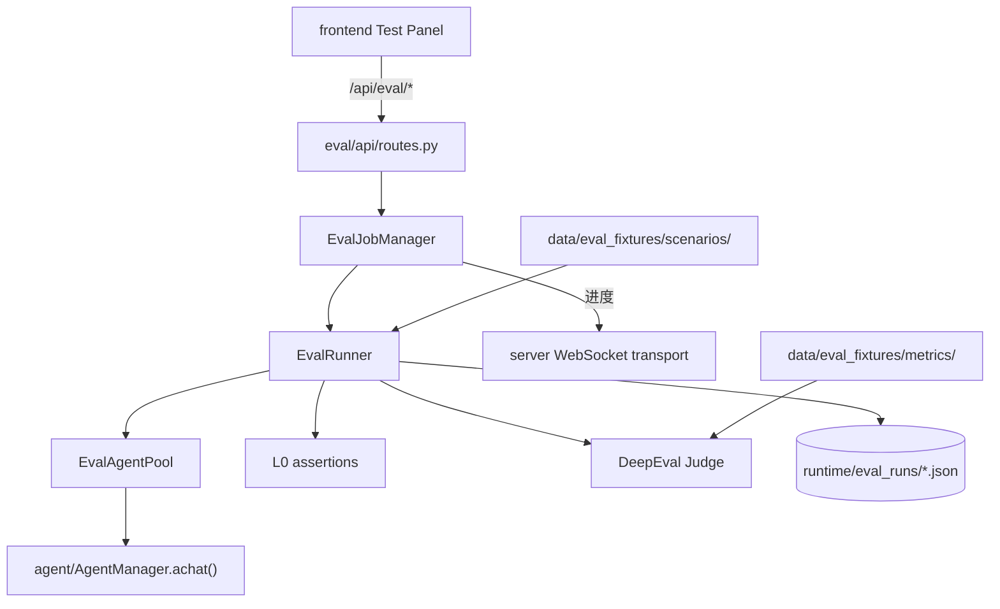

# eval — 评测子系统

> 对外标准对照说明见 [docs/eval-standards-alignment.md](../docs/eval-standards-alignment.md)（能力域、HEART/ESConv、ISO/NIST 映射表）。

`eval/` 对 Agent 进行自动化回归与质量评测：多轮场景对话、L0 规则断言、LLM Judge（DeepEval GEval）、情绪支持专项评测。支持同步执行与后台异步任务，结果持久化到 `runtime/eval_runs/`。

## 职责

| 能力 | 实现位置 |
|------|----------|
| HTTP API | `api/routes.py` |
| 异步任务与取消 | `application/job_manager.py` |
| Agent 调用封装 | `application/agent_client.py` |
| 进程级 Agent 复用 | `application/agent_pool.py` |
| 场景编排主流程 | `domain/runner.py` |
| YAML 场景加载 | `domain/scenario.py` |
| L0 断言 | `domain/assertions/` |
| LLM Judge | `domain/judge/` |
| 模拟用户 | `domain/users/` |
| 结果持久化 | `infrastructure/persistence.py` |

## 架构



### 分层设计

```
eval/
├── api/            # HTTP 路由（挂载到 server/app.py）
├── application/    # 用例编排：任务管理、Agent 客户端、连接池
├── domain/         # 纯业务：场景、断言、Judge、模拟用户
└── infrastructure/ # I/O：持久化、环境探测、遥测记录
```

### 主要 API

| 路径 | 说明 |
|------|------|
| `GET /api/eval/scenarios` | 列出可用场景 |
| `POST /api/eval/scenario/run` | 同步运行单个场景 |
| `POST /api/eval/runs` | 提交异步评测任务 |
| `GET /api/eval/runs/{id}` | 查询任务状态与结果 |
| `POST /api/eval/emotion-support/run` | 情绪支持专项评测 |

进度事件在 `server/app.py` 装配时将 `transport` 注入 `EvalJobManager`，经 WebSocket 推送到前端 Test Panel。

## 场景与指标数据

- **Taxonomy**：`data/eval_fixtures/taxonomy.yaml`（8 能力域 + 受控 tags 词表）
- **场景**：`data/eval_fixtures/scenarios/{domain}/{smoke|judge}/`（公共 id 仍为 `{tier}/{stem}`）
- **断言片段**：`data/eval_fixtures/snippets/`（`assertion_sets`）
- **指标定义**：`data/eval_fixtures/metrics/`（如 `emotion_support.yaml`、`safety.yaml`）
- **结构说明**：`data/eval_fixtures/README.md`
- **运行结果**：`runtime/eval_runs/eval_*.json`（gitignore）

场景 YAML 必填字段：`domain`（能力域）、`tags`（1–3 个受控标签）。

**L0 断言类型：** `assistant_not_contains`、`assistant_contains`、`assistant_min_length`、**`assistant_max_length`**（`max_chars`）、`agent_emotion_in`、`tool_called`、**`tool_not_called`**、`text_not_matches`

**emotion smoke 契约：** 每场景 7 条断言；共享禁 AI 套话 + `max_chars: 120`（happy/surprised 为 140）

**HEART-7 探索指标：** `empathy`、`validation`、`attunement`、`resonance`、`supportive_tone`、`human_alignment`、`boundary_safety`

## 主要 API（补充）

| 路径 | 说明 |
|------|------|
| `GET /api/eval/coverage` | 覆盖矩阵（domain × tier） |

## 运行测试

评测通过 HTTP API / 前端 Test Panel 触发（数据在 `data/eval_fixtures/`），不再维护仓库内 pytest 套件。

```bash
# 启动服务后，在前端 Test Panel 或调用 /api/eval/* 运行场景
python -m server
```

评测 API 随 `python -m server` 一同启动，无需单独进程。

## 与外部模块的关系

- **挂载点**：`server/app.py` 调用 `create_eval_routes(job_manager)`
- **Agent**：`EvalAgentClient` 直接 `await AgentManager.create()` 并 `achat()`，不经 WebSocket 队列
- **配置**：`shared.config.resolve_eval_scenarios_dir()` 解析场景目录
- **前端**：`frontend/src/features/test/`、`frontend/src/services/eval/`
