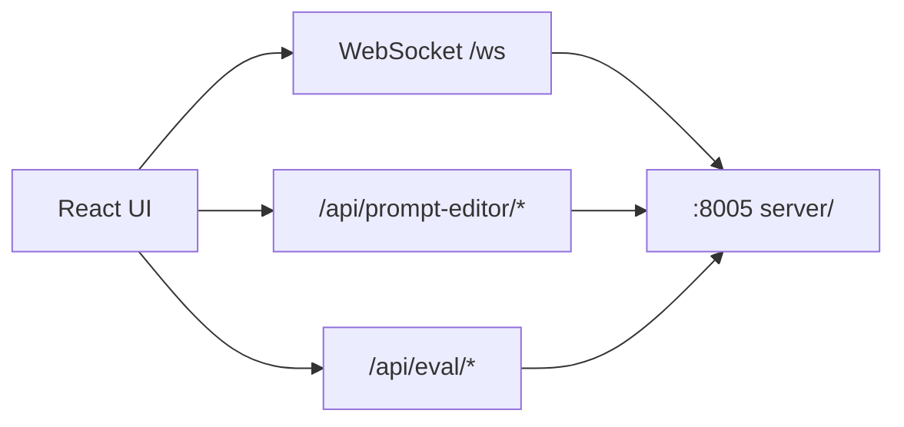

# frontend — Web 客户端

移动优先 Web UI，提供实时聊天、提示词编辑（`/config`）与评测 Test Panel。

## 职责

| 功能 | 路径 |
|------|------|
| 实时聊天（文本 / 语音） | `src/features/chat/` |
| 提示词编辑 | `src/features/config/` → `/config` |
| 评测 Test Panel | `src/features/test/` |
| WebSocket 与 API 服务 | `src/services/` |

## 架构



开发服务器（Vite，默认 `:5173`）将 `/ws` 与 `/api/*` 代理到后端 `:8005`，无需额外 CORS 配置。

## 本地启动

```bash
npm install
npm run dev
```

请先在项目根目录启动统一服务端：

```bash
python -m server
```

## 页面

| 路由 | 说明 |
|------|------|
| `/` | 聊天主界面 |
| `/config` | `soul.yaml` 提示词编辑（桌面三栏布局） |
| Test Panel | 聊天页内嵌，触发 eval 场景回归 |

## 局域网 HTTPS 语音

本机 `localhost` 可直接使用麦克风。若通过手机或局域网 IP 访问，浏览器要求 HTTPS；证书生成见 `web-portal/ssl/README.txt`。

## 相关文档

- 后端 WebSocket 协议与 Handler 编排：[server/README.md](../server/README.md)
- 评测 API 与场景：[eval/README.md](../eval/README.md)
- 项目整体启动与配置：[README.md](../README.md)
