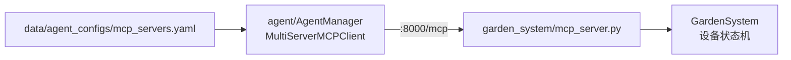

# mcp_servers — 设备控制 MCP Server

`mcp_servers/` 以独立进程运行，通过 [FastMCP](https://github.com/jlowin/fastmcp) 将庭院 / 智能家居设备能力暴露为 MCP 工具。`agent/` 作为 MCP 客户端连接此处，使智能体能够查询天气、控制割草机、灌溉、泳池、热泵、机械臂等。

## 职责

| 组件 | 说明 |
|------|------|
| `garden_system/mcp_server.py` | FastMCP HTTP 服务主入口，注册 `@mcp.tool` |
| `garden_system/garden_system.py` | 设备事件状态机（`GardenSystem` 单例） |

## 架构



Agent 启动时读取 `data/agent_configs/mcp_servers.yaml`，通过 `langchain_mcp_adapters` 将远程工具并入 LangGraph agent 的 `tools` 列表。MCP Server 不可达不会导致进程崩溃，但日志会出现 `[warn] MCP server '...' is unavailable`。

## 启动

```bash
python mcp_servers/garden_system/mcp_server.py
```

默认监听 `http://127.0.0.1:8000`，MCP 端点为 `/mcp`。

## 启用 Agent 侧连接

编辑 `data/agent_configs/mcp_servers.yaml`，取消注释并配置：

```yaml
mcpServers:
  garden:
    url: http://127.0.0.1:8000/mcp
```

修改后需重启 `python -m server`（或重新创建 `AgentManager`）以重新加载工具。

## 与主服务的关系

| 进程 | 端口 | 说明 |
|------|------|------|
| `python mcp_servers/garden_system/mcp_server.py` | `:8000` | 设备 MCP Server |
| `python -m server` | `:8005` | WebSocket + HTTP API |

两者互相独立，按需启动。仅文本对话可不启动 MCP Server；需要设备控制能力时必须同时运行。

## 日志

使用 `shared.observability.logging`，与主项目日志风格一致。
