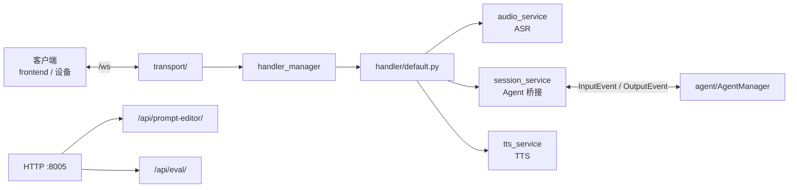

# server — 多模态服务端

`server/` 是面向客户端的 I/O 与编排层。它在同一进程（默认 `:8005`）提供 WebSocket 实时会话、Prompt 编辑 HTTP API，并挂载 eval 评测 API。

核心推理不在此包内，而是通过 `multimodal/session/` 桥接到 `agent/`。

## 职责

| 能力 | 实现位置 |
|------|----------|
| WebSocket 连接管理 | `transport/` |
| 每客户端业务编排 | `handler/` |
| 语音识别 (ASR) | `multimodal/audio/` |
| 语音合成 (TTS) | `multimodal/tts/` |
| Agent 会话桥接 | `multimodal/session/` |
| Prompt / 记忆管理 API | `api/prompt_editor/` |
| Eval 进度推送 | `adapters/eval_progress.py` |

## 架构



### 请求流（语音模式）

```
/ws 连接 (需 client-id)
  → WebSocketTransport.handle_starlette_connection()
  → HandlerManager.create_or_reuse_handler()
  → Handler.setup_services()  创建 ASR / Session / TTS

客户端音频 bytes
  → Opus 解码 → AudioService → ASR final 文本
  → SessionService.put_event() → agent_input_queue

Agent 流式回复
  → agent_output_queue → SessionService
  → 文本 JSON 回客户端 +（语音模式）TTS → Opus → 客户端
```

文本模式走同一条链路：`handle_user_message` 将用户 JSON 文本包装为 ASR final，复用 `asr_result_handler`。

### 目录结构

```
server/
├── app.py              # Starlette 应用组装
├── server.py           # uvicorn 入口
├── transport/          # WebSocket 传输层
├── handler/            # 每连接 Handler（default.py 为主实现）
├── multimodal/
│   ├── audio/          # ASR 服务 + provider 工厂
│   ├── tts/            # TTS 服务 + backends 工厂
│   └── session/        # Agent 后端工厂与队列桥接
├── api/prompt_editor/  # soul.yaml 等 HTTP CRUD
└── adapters/           # WS 日志桥、eval 进度通知
```

### Session 后端注册

`multimodal/session/backends/factory.py` 按 `agent_type` 配置选择后端：

| agent_type | 后端类 |
|------------|--------|
| `agent_manager`（默认） | `agent.manager.AgentManager` |
| `yard_manager` | `agent.manager.AgentManager` |
| `robot` | `server.multimodal.session.backends.robot_agent.RobotAgent` |

## 启动

```bash
python -m server
# 或安装后：gardenai-server
```

默认监听 `0.0.0.0:8005`，提供：

- `WebSocket /ws` — 实时会话
- `/api/prompt-editor/` — 提示词与记忆管理
- `/api/eval/` — 评测任务（路由定义在 `eval/api/routes.py`，挂载于此）

## 配置

服务端参数（端口、handler 类型、ASR/TTS 提供商、模态开关）由 `shared/config/server.py` 的 `ServerConfig` 定义，与 Agent 配置共用根目录 `.config.yaml`。

详见 [shared/README.md](../shared/README.md) 与根 [README.md](../README.md) 的配置章节。
