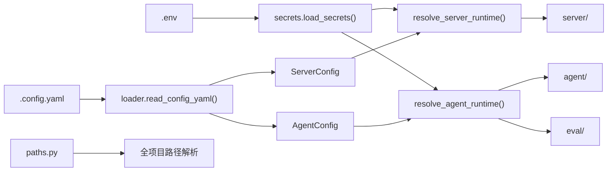

# shared — 横切基础设施

`shared/` 提供全项目共用的配置加载与可观测性，避免 `server/`、`agent/`、`eval/` 各自重复实现路径解析、密钥读取和日志初始化。

## 职责

| 能力 | 包路径 |
|------|--------|
| 仓库路径常量 | `config/paths.py` |
| 统一 YAML 加载 | `config/loader.py` |
| 密钥（.env） | `config/secrets.py` |
| 服务端配置模型 | `config/server.py` |
| Agent 配置模型 | `config/agent.py` |
| 运行时合并（配置 + 密钥） | `config/resolve_server.py`、`resolve_agent.py` |
| 结构化日志 | `observability/logging/` |
| Langfuse 安全封装 | `observability/langfuse_safe.py` |

## 架构



### 配置分层原则

1. **`.config.yaml`** — 运行时参数（URL、模型名、功能开关、路径）。**禁止**写入 API Key。
2. **`.env`** — 密钥与凭证（`GLM_OPENAI_API_KEY`、ASR/TTS Token 等）。
3. **`resolve_*_runtime()`** — 合并配置与密钥，做校验（如 `llm_base_url` 必填）和副作用（如创建 FAISS 目录）。

### 路径常量（`config/paths.py`）

| 常量 / 函数 | 默认位置 |
|-------------|----------|
| `DATA_DIR` | `data/` |
| `PROMPTS_DIR` | `data/prompts/` |
| `EVAL_FIXTURES_DIR` | `data/eval_fixtures/` |
| `RUNTIME_DIR` | `runtime/` |
| `WORKSPACE_DIR` | `runtime/workspace/` |
| `EVAL_RUNS_DIR` | `runtime/eval_runs/` |

## 公共 API

```python
# 配置
from shared.config import load_secrets
from shared.config.server import load_settings as load_server_settings
from shared.config.agent import load_settings as load_agent_settings
from shared.config.resolve_server import resolve_server_runtime
from shared.config.resolve_agent import resolve_agent_runtime

# 日志
from shared.observability.logging import configure_logging, get_logger, LogModule
```

`agent/configs/` 中的 `settings.py`、`resolve.py` 为兼容重导出，新代码应直接使用 `shared.config`。

## 日志

`observability/logging/` 提供模块化结构化日志：

- Console 彩色输出
- JSONL 文件（`runtime/logs/` 或项目根 `logs/`）
- WebSocket sink（`set_session_log_deliver` 注入全局 deliver，按 `payload.session_id` 路由到在线连接）

使用 `get_logger(LogModule.AGENT)` 等按模块分类，配合 `bind_session()` 绑定会话上下文。
